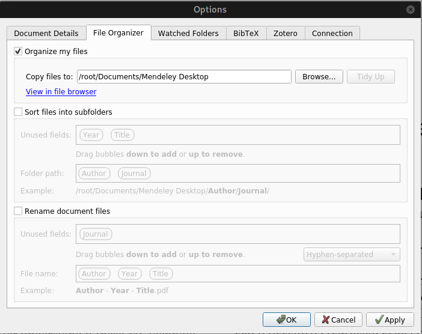

# Mendeley-Docker
Mendeley Desktop v1.19.8 in Docker

---

Although [Docker](https://www.docker.com/) help developers to spread their works in a fast and easy way, this repository uses docker to install a Mendeley-Desktop on your host-system whether as a fresh and easy installation or as a secondary installation to apply another Mendeley account as Mendeley-Desktop does not support multiple accounts simultaneously. For myself, the second case matters. 

# Requirements

At first, make sure you have installed docker. 

```bash
$ sudo docker run hello-world
Unable to find image 'hello-world:latest' locally
latest: Pulling from library/hello-world
2db29710123e: Pull complete
Digest: sha256:cc15c5b292d8525effc0f89cb299f1804f3a725c8d05e158653a563f15e4f685
Status: Downloaded newer image for hello-world:latest

Hello from Docker!
This message shows that your installation appears to be working correctly.

To generate this message, Docker took the following steps:
1. The Docker client contacted the Docker daemon.
2. The Docker daemon pulled the "hello-world" image from the Docker Hub.
(amd64)
3. The Docker daemon created a new container from that image which runs the
executable that produces the output you are currently reading.
4. The Docker daemon streamed that output to the Docker client, which sent it
to your terminal.

To try something more ambitious, you can run an Ubuntu container with:
$ docker run -it ubuntu bash

Share images, automate workflows, and more with a free Docker ID:
https://hub.docker.com/

For more examples and ideas, visit:
https://docs.docker.com/get-started/
```

So if you didn’t see the 	above screen, you should install docker at first. 


## How To Install Mendeley-Docker

```bash
git clone --depth 1 https://github.com/javadr/mendeley-docker

# Use the below just once to build the mendeley image 
./build.sh 
```

This stage downloads approximately 200 MB and takes 800 MB of your storage afterward. (Direct Installation of Mendeley-Desktop on your host consumes around 500 MB without including the required libraries) 

## Usage

```bash
# To run the installed Mendeley-Desktop docker image
./run.sh
```

* It runs Mendeley-Desktop inside the Ubuntu 20.04 (LTS) forwarding the X windows on your host.

* Saves the configuration data on the following address:
  * `~/.local/share/data/Mendeley Ltd./Mendeley Desktop-docker`  
  * `~/.config/docker-apps`
  
* Mounts the following directory to save the `pdf` persistently on the host machine, however, should be set in the Mendeley Options once; see below image
  * `~/Documents/Mendeley Desktop-docker`
  
    

## Configure a script to run it from your `PATH`

```bash
$ echo '#!/usr/bin/bash
currentDir="$(pwd)"
cd "/PATH-TO/mendeley-docker" || exit
source run.sh &
cd "$currentDir" || exit '| sudo tee /usr/local/bin/mdd

$ sudo chmod a+x /usr/local/bin/mdd
```
Replace the `PATH-TO` with the path of `mendeley-docker`. Now running `mdd` in terminal will load the `mendeley-docker`. 

## How to create Desktop launcher

```bash
$ echo "[Desktop Entry]
Name=Mendeley Desktop [Docker]
GenericName=Research Paper Manager
Comment=Mendeley Desktop is software for managing and sharing research papers
Exec=bash -c 'cd "/PATH-TO/mendeley-docker" || exit && source run.sh &'
Icon=mendeley
Terminal=false
Type=Application
Categories=Education;Literature;Qt;
X-SuSE-translate=false
MimeType=x-scheme-handler/mendeley;application/pdf;text/x-bibtex;
X-Mendeley-Version=1" > ~/.local/share/applications/mendeleydesktop+docker.desktop

$ cp /PATH-TO/mendeley-docker/images/mendeley.png ~/.icons
```


## Miscellaneous

* `clean.sh` deletes all configuration files and the saved `PDF`s
* `wipeout.sh` purges your host machine from the `mendeley-docker`'s image and all related files. 


## Todo 

* [ ] Resolve ownership issue; all files are saved with `root:root` ownership in the host machine
* [ ] Download Mendeley Desktop file outside the docker; makes docker image more concise as installation of some packages like `curl` could be neglected
* [x] Prepare a desktop launcher
* [ ] `Makefile` instead of  `build.sh`, `clean.sh`, `wipeout.sh`
